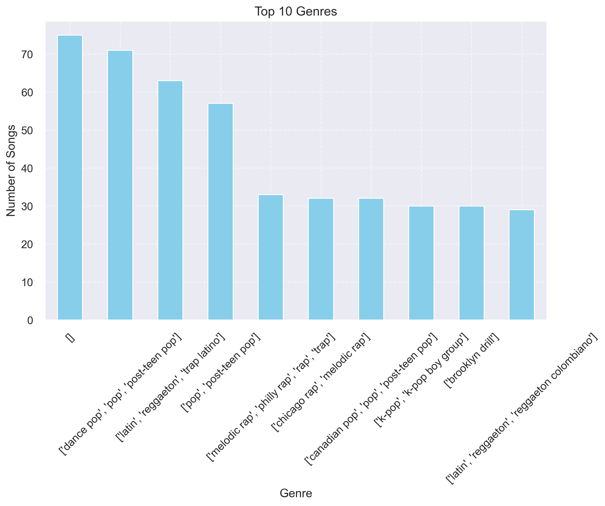
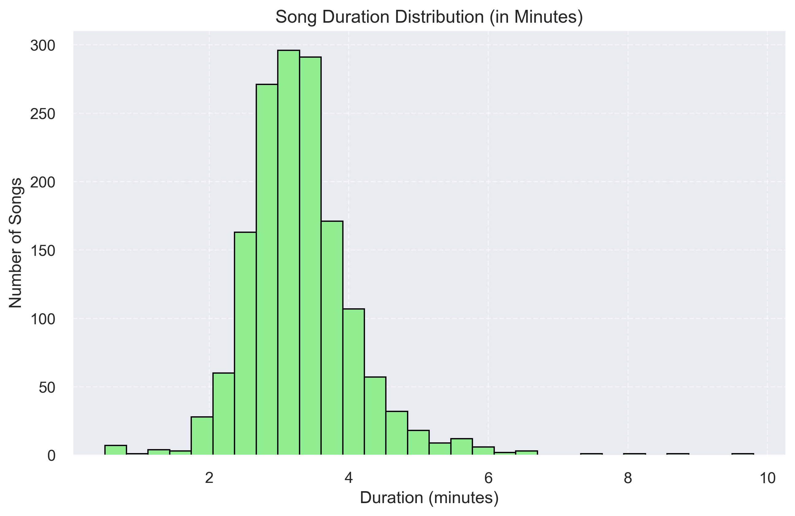
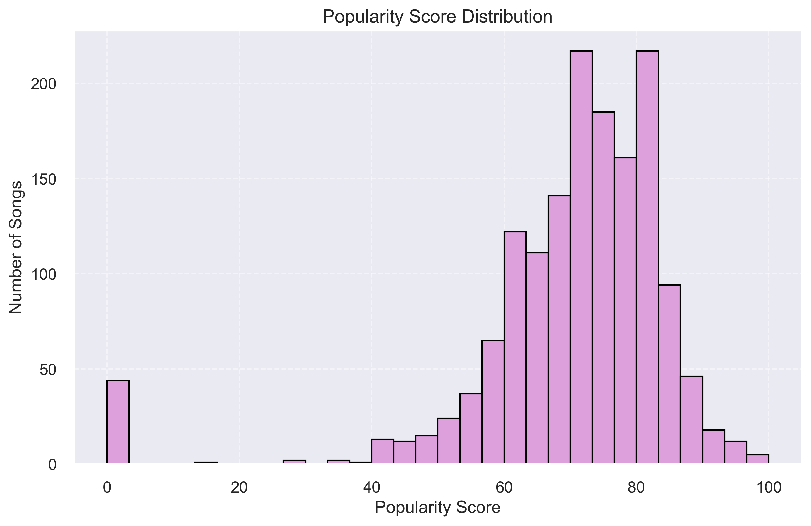
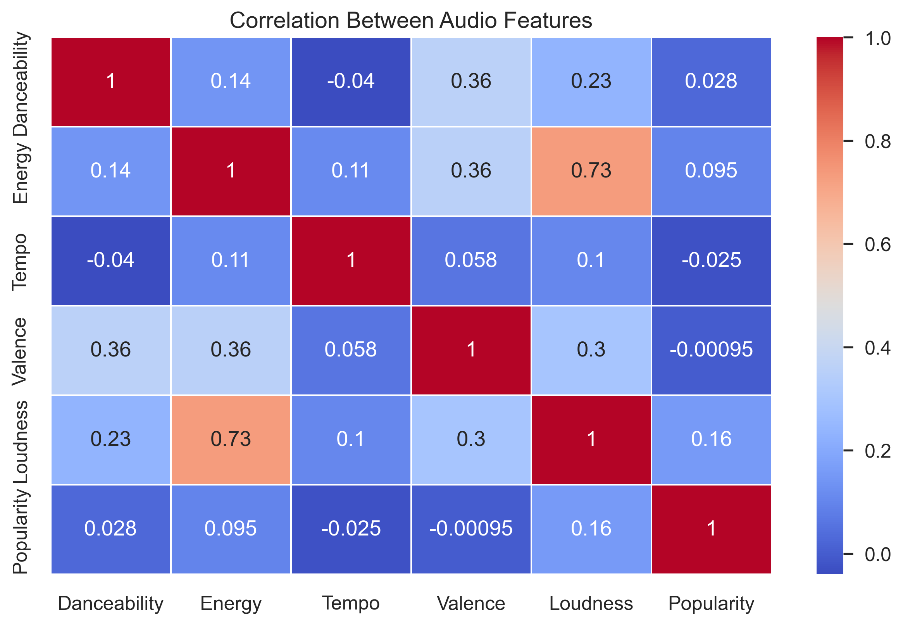

# 🎧 Spotify Data Analysis

This project explores Spotify’s Top Tracks dataset using Python and data visualization libraries. It includes data cleaning, transformation, and detailed visual insights into audio features and song trends.

---

## 📁 Files

- `Spotify_Data_Analysis.ipynb` – Main Jupyter notebook with analysis
- `spotify_dataset.csv` – Original dataset
- Graph images:
  - `top_genres.png`
  - `Song_duration_distribution.png`
  - `Popularity_distribution.png`
  - `Correlation_audio_features.png`

---

## 🛠️ Libraries Used

- `pandas`  
- `numpy`  
- `matplotlib`  
- `seaborn`  

---

## 📊 Visual Insights

### 🔹 Most Common Genres

  
> Pop, hip-hop, and dance are the most dominant genres in the Top 200 tracks.

---

### 🔹 Song Duration Distribution

  
> Most songs lie between 3 to 4 minutes in length — the sweet spot for Spotify hits.

---

### 🔹 Popularity Score Distribution

  
> Most tracks have popularity scores between 60 and 90.

---

### 🔹 Correlation Between Audio Features

  
> Strong correlation observed between energy, loudness, and danceability.

---

## 📌 Key Takeaways

- 🔥 Pop and hip-hop dominate the charts
- 🕒 Most tracks are around 3–4 minutes long
- 💃 Energy, danceability, and loudness are strongly linked
- 🎯 Popular songs tend to have specific feature profiles

---

## 📣 Author

**Nandini Vyas**  
Python | Data Science Beginner | Jupyter Lab Fan ❤️  
[LinkedIn](www.linkedin.com/in/nandini-vyas-27b142368)

---

## ⭐ Give this project a star if you liked it!
